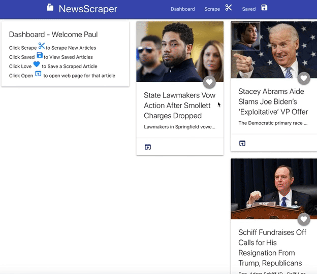
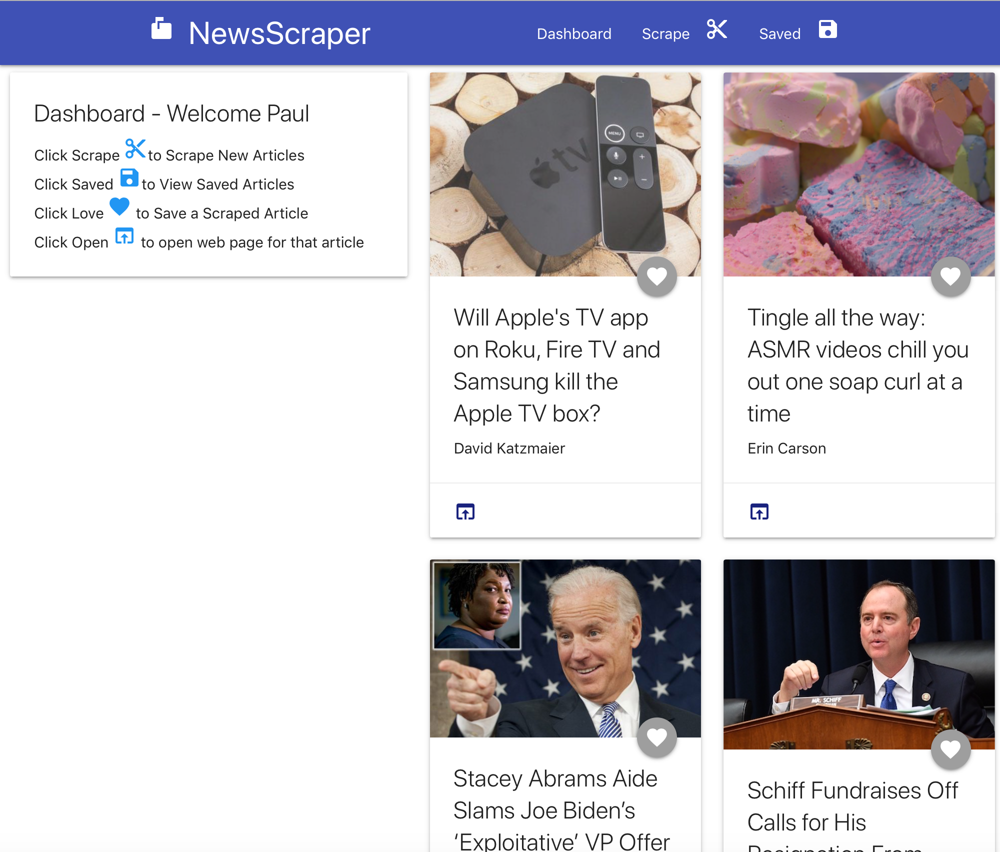
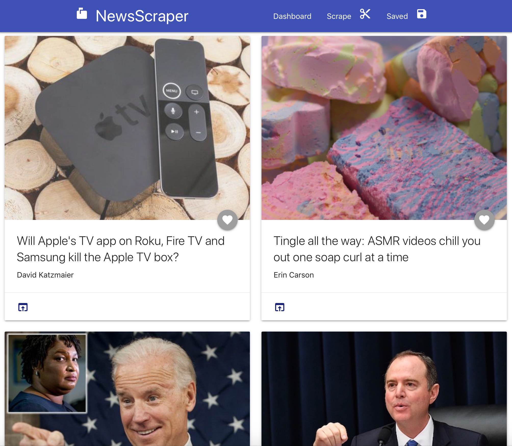
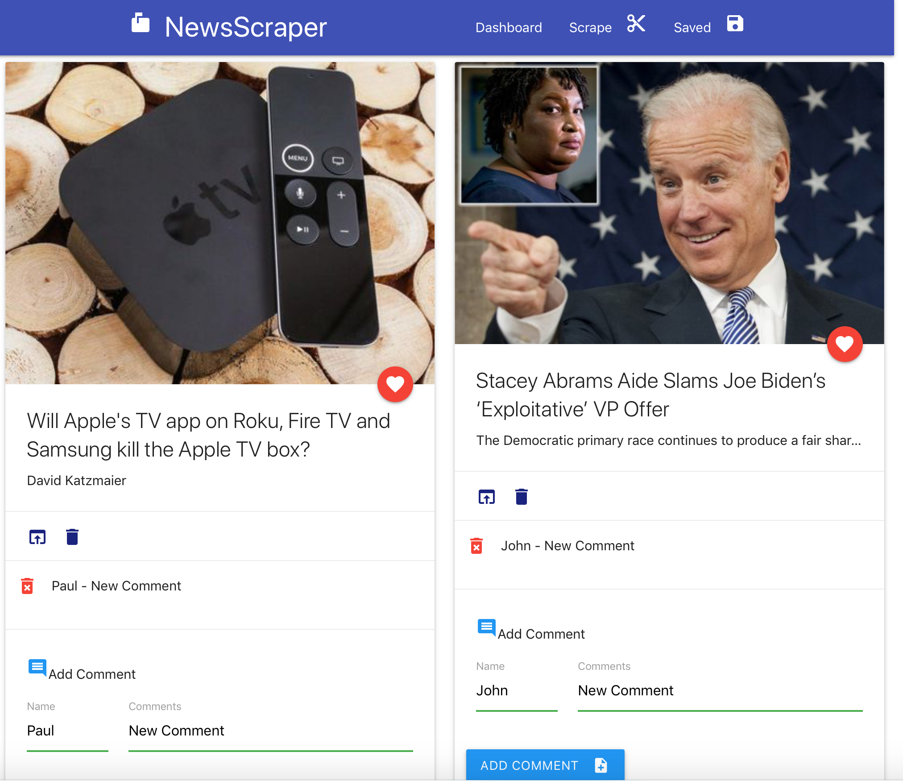

# NewsScraper

## Overview

Scrapes news articles and allows you to save for later viewing.  Also lets users view and leave comments on the latest news. Current I am scraping news articles from CNET and Free Beacon but have it setup to add as many as I like.

**NOTE**:  The app is fully deployed to the gooogle could platform and Heroku.  I did NOT use handlebars since I chose to use react instead since REACT is a much more important tool moving forward.

### Deployment

This is deployed to **Google Cloud Platform** AND Heroku -- I deployed to both.  GCP provides several huge advantages especially as it relates to security and hiding keys and credentials.  When app is running in test mode, sensitive data is stored in hidden files on developers local machine. When depoloyed to google cloud platform, the services keys, credentials etc are automatically protected and accessed inside the google cloud platform App engine.

## Links

* [Live Google Cloud Platform Site](https://paullinck-newsscraper.appspot.com)
* [Live Heroku Site](https://paullinck-newsscraper.herokuapp.com)
* [GitHub for this](https://github.com/plinck/newsscraper)
* [My Portfolio](https://plinck.github.io/My-Portfolio/)

## Technologies Used

* [x] HTML/CSS/Javascript
* [x] REACT
* [x] Node.js, Express
* [x] MongoDB and Mongose (for Schemas)
* [x] MongoDB Atlas Clusters
* [x] Axios (in node server and REACT components)
* [x] Cheerio
* [x] Materialize
* [x] Google Cloud Platform
* [x] Heroku (hosted on Heroku and GCP)

## Screenshots

## Details

  1. Whenever a user visits, the app scrapes stories from a news outlet displays artilces for the user.  If there is an image with teh article, it displays it, otherwise, I provide a generic news image.  
     * Each scraped article is saved to Mongo only when the user clicks the heart icon (save).  I chose not to save all articles since there is no reason to save articles the user does not care about. The app scrapes and display the following information for each article:

     * Headline - the title of the article

     * Summary - a short summary of the article

     * URL - the url to the original article
  
     * ImageUrl - if it exists

  2. Users can leave comments on the articles they saved to revisit them later.

  3. Users can delete saved articles and comments left on articles. All stored comments should be visible to every user.

## Architecture

### Model View Controller (with lightweight controller routing to business and data logic)

* Views / `/client` - `/public` (dev) and `/build` (productoion) HTML/CSS/JS using REACT
  * Materialize JS and CSS
  * REACT Components

* Controllers - `/server.js` - REACT Static Routes and `/api` routes for Mongo and Cheerio

* Model (Data) - `/model`
  * Uses Mongo and Mongoose for Data Layer